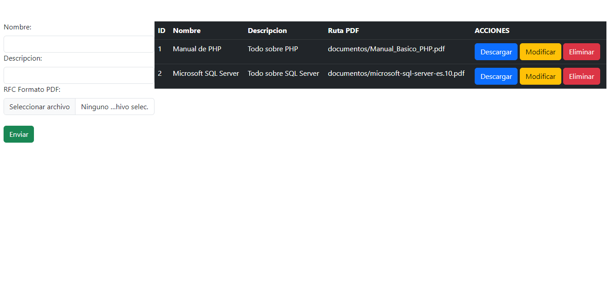
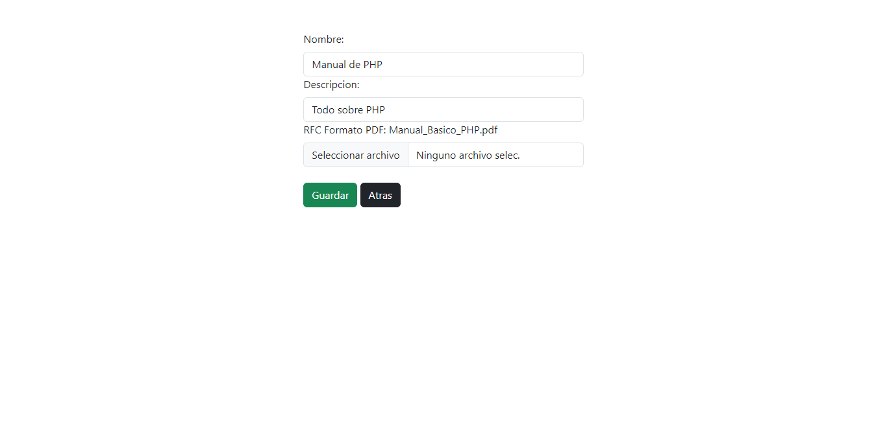

#   Guardar documentos

## Agregar y Leer información
<p align="center"></p>

## Actualizar información
<p align="center"></p>


##  Resetear datos de la tabla
```
TRUNCATE TABLE nombre_de_la_tabla;
ALTER TABLE nombre_de_la_tabla AUTO_INCREMENT = 1;
```


##  FORM UPDATE: Visualizar el DOC con todo y ruta
```HTML
<div class="form-group">
    <label for="doc_pdf" class="form-label">RFC Formato PDF:</label>
    <?php if ($documento && isset($documento['doc_pdf'])): ?>
        <span><?php echo $documento['doc_pdf']; ?></span><br>
    <?php endif; ?>
    <input type="file" name="doc_pdf" accept=".pdf" class="form-control" required>
    <div class="invalid-feedback">Sube el archivo en formato pdf</div>
</div>
```